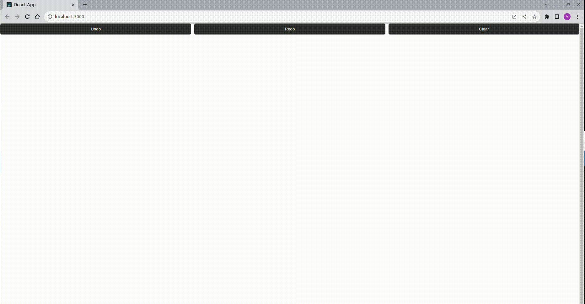

# Bem-vindo à Aplicação de Renderização de Círculos!

Este projeto foi iniciado com [Create React App](https://github.com/facebook/create-react-app).

## Scripts Disponíveis

No diretório do projeto, você pode executar:
### `npm install`
### `npm start`

Este comando inicia a aplicação no modo de desenvolvimento.\
Abra [http://localhost:3000](http://localhost:3000) no seu navegador para ver a aplicação em ação.

  <b>Uma Aplicação para Criar e Gerenciar Círculos na Tela</b>

## Requisitos do Projeto

Este projeto apresenta as seguintes funcionalidades:

- Os usuários podem clicar em qualquer lugar na página.
- Um pequeno círculo será renderizado na posição do clique.
- A cada clique, os círculos criados anteriormente são mantidos e um novo é adicionado.
- Além disso, duas funcionalidades foram implementadas:
  - Desfazer (undo): Permite reverter a última ação (criação de círculo).
  - Refazer (redo): Restaura a última ação desfeita.

## Tecnologias Utilizadas

Este projeto foi desenvolvido utilizando a seguinte tecnologia:

- **React JS**

Vamos soltar a imaginação e se divertir criando círculos!
